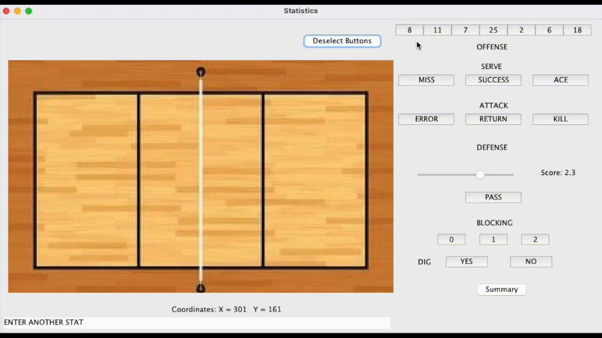

# Volleyball-Statistic-Application
A volleyball application to track offensive and defensive statistics of players and the team, supplying analytical feedback to athletes and coaches to achieve success in future matches. Implemented a GUI to enhance user experience, displaying average scores and percentages of each statistic using OOP, Methods, and ArrayList/Array Manipulation.

  

 

### Inspiration Behind the App
Growing up playing volleyball competitively for nearly half of my life, I have quite an extensive background in volleyball. Especially being undersized, I had to understand the game well and anticipate opponent's attacks to gain a competitive advantage. All players have tendencies. Some attackers favour a cross-court hit instead of a line shot, some setters like to set the outsides more than their right sides, and some passers pass better on one side than the other. Picking up on all these tendencies can put teams in a better position to win and anticipate the opponent's actions. Statistics provide concrete data on player's tendencies and weaknesses and are used by professional teams to gain a competitive advantage.

### Tech Stack
**Languages**: Java  
**IDE**: Java Eclipse  

### About
User’s can track each player's offensive and defensive statistics throughout the game. These statistics include Serving, Attacking, Digging, and Blocking, while also having the capability to track the location of the some of the statistics to provide more analytical insight. 

Once the game is finished, all the collected statistics are shown as a summary for each player and the team. These statistic summaries provide extensive insights, regarding success percentages and attempts. The generated summaries can be used to provide feedback to players and teams by highlighting their strengths, weaknesses, and tendencies. 

## Walkthrough
### Player, Number, and Position Entries
Input each player’s name, number and position so that the statistics for each player can be tracked.

### Enter Gameplay Statistics
Throughout the game, the user will track the statistics of each player. The Attack and Dig statistic also tracks the location of the ball on the court so the user also must select the coordinates of where the play took place. There is no location tracking needed for the Serve, Pass, and Blocking statistic.

### End Of Game Summary
Once the game has finished, a summary will be displayed for each player and the team to evaluate their performance. Players will be able to see a general summary of their offensive and defensive statistics, providing them with a general overview of some of their weaknesses and strengths throughout the game. A team summary will also be provided to indicate how well the team did as a whole. These informative summaries can be used to provide feedback for players in order to improve in the future. 

## Next Steps 
Although I am very satisfied with this project, there is still much room for improvement in order to make this a useful app for teams. One of the functionalities I failed to achieve was displaying the location of the Attacking and Digging statistics for each player in the summary section. This feature will provide useful insight to players and teams.  

Some smaller features I would like to add:  

* Include more player entry submissions because normally, teams will substitute players in and out of the game, resulting in more than 7 players generating statistics
* Have a feature to save the game summary statistic as an excel spreadsheet with all the statistics or an image of the game summary so teams can look at various statistic summaries for each game and gain a bigger picture perspective
* Add more colour and improve the UI/UX to make the application more enjoyable and intuitive 

